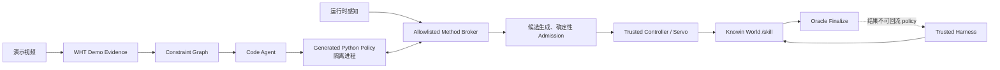

# Demo2Graph2Code 系统迁移与首月执行计划

## 1. 总结与边界

目标不是“把 insert 调到某个毫米数”，而是沉淀一套可复用的：

```text
演示视频
→ 时序与关键帧证据
→ 带抓取/放置/DOF/接触约束的任务图
→ Agent 生成可执行 Python policy
→ reactive node 闭环
→ 节点内高频伺服
→ 评测、诊断、修复
```

当前事实：

- WHT 已实现较完整的 KSM harness、视频拆解、CoTracker 和 GraspNet wrapper；共 `131 passed, 1 skipped`，但尚无真实任务完成记录，不能把单测或 `execution_ready` 当成效果。
- 目标目录中的 KSM 与 WHT 最新版本字节一致，无需再次覆盖。
- 最新 Knowin World 位于 `/mnt/nas/knowin_sim/sim_workspace`，但运行环境实际在 1024，与 1022 的源码目录不共享文件系统。
- 首月先跑通单试管的抓取、空中转向、对准、插入；谓词精度继续修，但不能阻塞方法链建设。
- 主方法输出 Python code；WHT 原 YAML 路径原样保留为 baseline，不作为当前主线。
- Graph 是任务知识和闭环状态，不展开高频控制的每一个 tick。

## 2. Public-safe 代码仓与迁移

在 `/mnt/data/wenqian/demo-graph-lab` 初始化独立 Git 仓，并连接公开空仓 [muz1lee/ksm](https://github.com/muz1lee/ksm)。必须先确认 Git top-level 不再落到错误的 `/mnt/data/.git`。

采用以下结构：

```text
demo-graph-lab/
├── AGENTS.md
├── ALGORITHM_PLAN.md
├── PROGRESS.md
├── components/
│   ├── knowin-skill-manager/       # WHT KSM 原样快照
│   ├── robot-subtask-seg/          # 视频拆解与 demo bundle
│   ├── video-perception-service/   # CoTracker wrapper
│   └── grasp-proposal-tools/       # 仅 WHT GraspNet wrapper
├── method/demo_graph/              # 我们的新方法
├── adapters/
│   ├── knowin_world/
│   ├── demo_bundle/
│   ├── grasp_proposals/
│   └── observability/
├── experiments/insert_tubes/
├── configs/examples/
├── tests/integration/
└── third_party/DEPENDENCIES.md
```

迁移规则：

1. 首个 commit 只建立 `.gitignore`、安全规则和第三方依赖说明。
2. 第二个 commit 按明确 allowlist 导入四个 WHT 组件，算法文件保持字节不变；保存逐文件 SHA-256 manifest，并打 `wht-import-20260726` tag。
3. 第三个 commit 才加入现有 `AGENTS.md`、`ALGORITHM_PLAN.md`、`PROGRESS.md`、净化后的 schema/tools。
4. 后续所有 graph、Python backend、runtime adapter、servo 都放在 `method/` 或 `adapters/`，不混进 WHT import commit。
5. 永远不执行 `git add .`；只添加 allowlist，并在推送前做 secret、文件大小、许可证和 GT 泄露扫描。

明确不进入公开仓：

- `.openaikey`、`.qwenkey`、`secrets.env`、内部 endpoint/config。
- `runs/`、`outputs/`、日志、视频、模型、checkpoint、venv、旧备份。
- Knowin World 源码、scene library、assets 和 nested Git。
- CoTracker vendor/checkpoint。
- `graspnet-baseline` 源码和权重；其许可证禁止再分发。
- 含 scene pose、asset ID、GT prompt、oracle 输出的旧 KSM artifacts。

许可证默认：首轮不添加开放源代码 LICENSE，公开可见但暂不授予再使用许可；保留已有 NOTICE 和完整归属说明，待确认 WHT/团队授权后再单独决定 Apache-2.0。

文档职责固定：

- `AGENTS.md`：稳定项目原则、GT 防火墙和强制阅读顺序，不放动态 TODO。
- `ALGORITHM_PLAN.md`：方法架构和研究假设。
- `PROGRESS.md`：最后验证时间、当前目标、最新实验、阻塞项、接下来三项任务及恢复命令。
- 每次有效实验或合并后必须更新 `PROGRESS.md`；原始 runs 不入 Git，只提交脱敏汇总。

## 3. 方法与系统架构



### Graph → Code

`ConstraintGraph` 作为 JSON/Pydantic artifact，不要求手写 YAML。每个 node 至少包含：

- goal、preconditions、postconditions、invariants；
- 抓取/放置位置与允许 DOF 等约束；
- 从视频证据引用而来的时序、关键帧和接触关系；
- 需要运行时补齐的 typed holes；
- controller reference、预算和成功/可恢复/致命转移。

Code Agent 输入仅包括 graph、demo evidence、允许的 API 说明和可信 controller registry，生成实现 node handler 与状态转移的 Python module。节点固定采用：

```text
READY
→ RESOLVING_HOLES
→ CANDIDATES_READY
→ ADMITTED
→ EXECUTING
→ VERIFYING
→ SUCCEEDED / RECOVERABLE / FAILED
```

策略在每个 node 开始前重新观察；若目标已经满足则直接跳过，避免“试管本来已竖直却又被错误转向”。

### 公开接口

- `PolicyBackend`
  - `LegacyYamlBackend`：包装现有 WHT 路径，不改原算法。
  - `PythonNodePolicyBackend`：主方法，生成受限 Python policy。
- `MethodAPI`
  - 只提供感知 track、机器人可观测状态、GraspNet proposals、候选检查和可信 controller 调用。
- `ActionCandidate`
  - 不可变绑定 `node_id`、观测 revision/digest、感知 track、frame/TCP、graph constraints、evidence 和 provenance。
- `CandidateSelector`
  - 只能选择、全部拒绝或请求额外证据；不能修改候选或直接执行。
- `ServoController`
  - 在可信 runtime/plugin 内执行高频 `observe → bounded correction → verify`；生成 policy 只接收 `Converged/Recoverable/Abort`。
- `RunManifest`
  - 记录 KSM commit、Knowin World commit/dirty hash、data/asset lock、配置摘要、模型、seed、graph/code digest 和 API 调用审计。

从 ZYH 只 clean-room 借鉴候选冻结、2D gripper/trajectory overlay、revision/digest、确定性 safety veto 和事件追踪；不复制其动态 swarm、raw `exec`、环境注入或未跑通的 executor。3D 点云候选图只保留为后续 ablation。

### GT 防火墙

生成 policy 必须运行在无网络、无 Knowin World/data 挂载、无密钥的隔离进程，只能通过 stdin/Unix socket 调用 Method Broker。仅靠 Python wrapper 或 AST 检查不够。

可信 parent 独占：

- `/session/reset`
- `/session/finalize`
- `/state`
- scene/task/evaluator 数据

主方法禁止访问：

- scene/asset 文件、精确 pose/尺寸/AABB；
- simulator entity ID、GT mask/contact；
- `/api/list_scene_assets`、EvalServer `/state`；
- success predicate、target binding 或由 GT 改名派生的字段。

允许通过传感器和感知 API 估计试管尺寸、当前姿态、抓取位置，并记录每次调用的 provenance。

## 4. Knowin World 接入与首月里程碑

部署拓扑固定为：

- 1022：`/mnt/data/wenqian/demo-graph-lab`，作为 Git source-of-truth。
- 1024：`/mnt/nas/knowin_sim/sim_workspace/services/ksm`，部署同一 Git commit 的独立 checkout/venv。
- Knowin World 保持外部依赖，不复制进 `ksm`。

新增 `KnowinWorldAdapter`：

- 开发模式：WebUI `5049` 取 frame/debug，pipeline `8000` 调试。
- 正式模式：使用 EvalServer `POST /session/reset → POST /skill → POST /session/finalize`，通过 queue-id 等待真正 quiescent。
- 不再使用 WHT 旧 runner 的端口推断、弱 reset/wait 或 GT predicate 作为正式评测路径。
- Python node 可在内部编译为不可变临时 KW skill 进行运输，但 YAML 不暴露为方法输出。
- 高频 insert servo 作为受审计 skill/controller plugin 在 runtime 内运行，不能由 LLM 经 HTTP 逐 tick 控制。

当前 Knowin World 和 data checkout 均为 dirty：开发实验可记录完整 diff hash 后使用，但只能标记为 non-golden；正式 benchmark 必须拒绝 dirty dependency，等待或建立 clean pinned runtime。

首月顺序：

1. 第 1 周：安全建仓、WHT 精确导入、131 项回归、1024 部署 checkout、runtime doctor。
2. 第 2 周：完成 `demo bundle → graph → Python policy`，跑通单试管抓取、持稳、空中转向和对准。
3. 第 3 周：接 GraspNet 多候选、关键帧相似性选择、后续插入约束反推 grasp DOF，并加入 insert servo。
4. 第 4 周：冻结代码与配置，在 RoboDojo `insert_tubes` 100 layouts 上跑主方法和 ablation，形成可复现实验表。

M1 节点固定为：

```text
observe target/holder
→ propose and select grasp
→ pick
→ verify attachment
→ reorient if needed
→ align
→ servo insert
→ verify inserted/upright
```

失败只允许有限、可归因恢复：重新感知、重新选候选、退回安全位、重抓；不允许无限 repair loop。

## 5. 验证与验收

仓库验收：

- 四个 WHT source digest 与原目录一致。
- `90+32+2+7` 单测全部通过，最多保留原有 1 个 skip。
- fresh clone 可安装和执行测试。
- 无秘密、GT artifact、禁止再分发源码、权重或大文件。

安全验收：

- 恶意生成代码尝试联网、读 scene/data/env 或调用 `/state` 时必须失败。
- 每个 Method API 调用都有 observation/provenance digest。
- Oracle 结果只能写入隔离 artifact，不能进入下一轮生成或修复 prompt。

效果验收：

- 首先取得至少一次真实单试管端到端成功，而不是 dry-run。
- 固定 20 个 layout/seed：至少 `16/20` 完成抓取、转向、对准，至少 `12/20` 完成 inserted + upright，才能称为 M1 稳定。
- 随后跑完整 100-layout 报告，分开统计 grasp、reorient、align、insert、task success、恢复次数和 API/LLM 成本。
- 使用相同模型、预算、runtime 和 seeds 比较：
  1. instruction-only direct code；
  2. demo evidence direct code、无 graph；
  3. demo graph → code；
  4. graph + demo-conditioned GraspNet；
  5. 完整 reactive graph + servo；
  6. human graph upper bound。
- 首月的论文判断依据是 graph、候选约束和闭环控制是否带来稳定相对提升；在此之前不宣称 AgentWorld、world model 或 leaderboard 创新。
